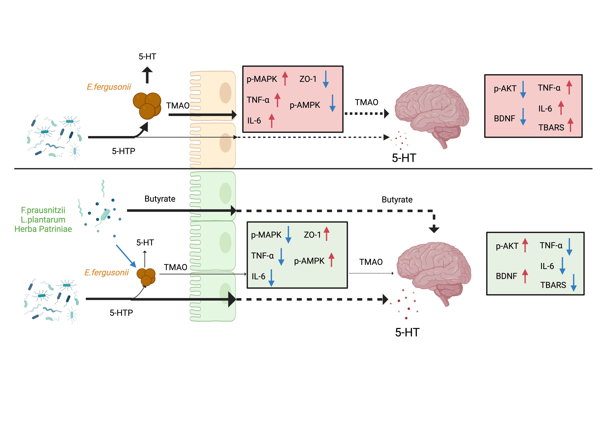

# 🧠 Targeting *Escherichia fergusonii* in Parkinson’s Disease via *Faecalibacterium prausnitzii*, *Lactiplantibacillus plantarum*, and Herba Patriniae 🌿🦠

<h1 align="center">Synergistic Modulation of Gut Dysbiosis in Parkinson’s Disease</h1>

  <em>Targeted suppression of <strong>E. fergusonii</strong> by a combination of traditional herbal extract and probiotics to restore 5-HTP and SCFA metabolism and alleviate gut-brain inflammation in Parkinson's disease.</em>

  

---

## 📜 Table of Contents
- [Overview](#overview)
- [Project Structure](#project-structure)
- [Analysis Pipeline](#analysis-pipeline)
  - [1. Enterotype Classification](#1-enterotype-classification)
  - [2. Personalized Metabolic Modeling (COBRA)](#2-personalized-metabolic-modeling-cobra)
  - [3. Machine Learning with SHAP Interpretation](#3-machine-learning-with-shap-interpretation)
- [Mechanistic Diagrams](#mechanistic-diagrams)
- [Data & Code Access](#data--code-access)
- [Citation](#citation)
- [Acknowledgements](#acknowledgements)

---

## Overview

Parkinson’s disease (PD) is often accompanied by gut microbial dysbiosis. However, the role of distinct **enterotypes** in influencing PD risk remains underexplored. This project aimed to identify subtype-specific microbial signatures and metabolic pathways in PD, and explore targeted interventions.

Key Highlights:
1. **Meta-analysis of 12 PD metagenomic datasets** (1,322 PD / 1,418 HC):  
   - Identified high-risk enterotype **ET-B (Bacteroidaceae-enriched)**.  
   - *E. fergusonii* identified as a key microbe associated with 5-HTP depletion and TMAO production.

2. **Constraint-based modeling (COBRA)**:  
   - Simulated microbial metabolic interactions using AGORA models.  
   - Predicted suppression of *E. fergusonii* via *F. prausnitzii* butyrate production and TMA scavenging.

3. **Experimental validation**:  
   - In vitro co-culture and PC12/Caco-2 assays showed that *F. prausnitzii* + *L. plantarum* combined with Herba Patriniae (HP) suppress *E. fergusonii*, restore butyrate/5-HTP, and reduce TMAO.  
   - Activation of p-Akt (neuronal) and p-AMPKα/ZO-1 (intestinal barrier), along with reduced TNF-α/IL-6.

---

## Project Structure
Parkinsons/
├── mechanisms.jpeg # Mechanism illustration
├── Graph abstract.png # Graphical abstract
├── Website addresses of each data.xlsx
├── Enterotype_data/
│ ├── Enterotype_classification_code/
│ └── ET-B / ET-L / ET-E
├── agora_cobratoolbox_code/
│ ├── create_panmodel_code.txt
│ └── initMgPipe_code.txt
└── xgboost_shap_code.ipynb

## Analysis Pipeline

### 1. Enterotype Classification
- **Script**: `Enterotype.R` (PAM clustering with Jensen–Shannon distance).
- **Visualization**: `PCA.R`.
- **Output**: Three enterotypes (ET-B, ET-L, ET-E) with alpha diversity, LEfSe results, SparCC networks, and species metadata.

### 2. Personalized Metabolic Modeling (COBRA)
| Step | File | Description |
|------|------|-------------|
| Pan-model construction | `create_panmodel_code.txt` | Combine AGORA2 models into genus-level pan-models |
| Community-level simulation | `initMgPipe_code.txt` | Simulate metabolite secretion under dietary constraints |

> **Dependencies**: MATLAB (R2021b+), COBRA Toolbox, IBM CPLEX

### 3. Machine Learning with SHAP Interpretation
- **Notebook**: `xgboost_shap_code.ipynb`
- **Process**:
  - Data preprocessing & train-test split  
  - XGBoost with hyperparameter tuning  
  - Cross-validation with AUC scoring  
  - SHAP analysis for top bacterial and metabolic predictors

---

## Mechanistic Diagrams

| Diagram | Description |
|--------|-------------|
|  | **Proposed mechanism**: In PD, *E. fergusonii* promotes TMAO and suppresses 5-HTP and butyrate. After intervention with HP + *F. prausnitzii* + *L. plantarum*, these pathways are restored, leading to improved gut-brain axis function. |

---

## Data & Code Access

- Raw sequencing datasets are listed in `Website addresses of each data.xlsx`, with links to public repositories (e.g., NCBI BioProjects).
- Enterotype-based microbial and functional analyses are in `Enterotype_data/`.
- All COBRA modeling scripts are under `agora_cobratoolbox_code/`.
- SHAP model interpretation and visualization in `xgboost_shap_code.ipynb`.

> Additional results and processed outputs will be uploaded to GitHub Releases.

---

## Citation

If you use this repository or find our work helpful, please cite:

> Wu X., Zhang T., Feng J., Park S.* (2025). Synergistic Effects of Herba Patriniae Extract and *F. prausnitzii* + *L. plantarum* on *E. fergusonii*-Driven Gut Dysbiosis in Parkinson’s Disease. *Journal Name*, *Volume*(Issue), Pages. https://doi.org/10.xxxx/xxxx

---

## Acknowledgements

This study was supported by the Biofusion Systems Lab, Hoseo University, and the National Research Foundation of Korea (RS-2023-00208567). Graphical illustrations were created using BioRender.

---
